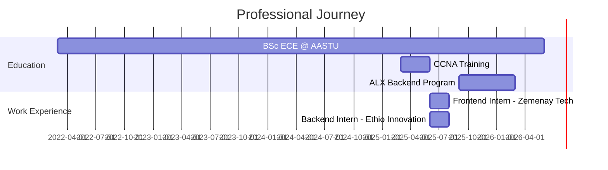

<div align="center">
<!-- Animated Gradient Header -->


<!-- Dynamic Typing Effect -->


<!-- Animated Status Badges -->
<p>
  
  
  
</p>

<!-- Location & University -->
<p>
  
  
</p>

<!-- Profile Views & Followers -->
<p>
  
  <a href="https://github.com/Urael7?tab=followers">
    
  </a>
  
</p>
</div>

---

## 👨‍💻 About Me

```javascript
const yafet = {
    location: "Addis Ababa, Ethiopia",
    education: "BSc. Electrical & Computer Engineering (AASTU)",
    currentGPA: "3.3/4.0",
    expectedGraduation: "June 2026",
    
    roles: [
        "Full Stack Developer",
        "Backend Specialist",
        "Frontend Engineer",
        "Problem Solver"
    ],
    
    certifications: [
        "CCNA - Cisco Certified Network Associate",
        "ALX Back-End Web Development",
        "Digital Innovation Bootcamp (AI/ML)"
    ],
    
    currentFocus: {
        backend: ["Node.js", "Express.js", "Laravel", "Django"],
        frontend: ["React", "Next.js", "Flutter"],
        learning: ["AI/ML", "Cloud Architecture", "Scalable Systems"]
    },
    
    passion: "Building solutions that make a real-world impact 🚀"
};
```

---

## 🛠️ Tech Arsenal

<details open>
<summary><b>💻 Programming Languages</b></summary>
<br>
<p align="center">
  
</p>
</details>

<details open>
<summary><b>🎨 Frontend Development</b></summary>
<br>
<p align="center">
  
</p>
</details>

<details open>
<summary><b>⚙️ Backend Development</b></summary>
<br>
<p align="center">
  
</p>
</details>

<details>
<summary><b>🗄️ Databases & Storage</b></summary>
<br>
<p align="center">
  
</p>
</details>

<details>
<summary><b>🔧 DevOps & Tools</b></summary>
<br>
<p align="center">
  
</p>
</details>

<details>
<summary><b>🤖 AI/ML & Data Science</b></summary>
<br>
<p align="center">
  
  
  
</p>
</details>

---

## 📊 GitHub Analytics

<div align="center">

<!-- GitHub Stats Cards -->
<table width="100%">
  <tr>
    <td width="50%">
      
    </td>
    <td width="50%">
      
    </td>
  </tr>
</table>

<!-- Streak Stats & Contribution Graph -->
<table width="100%">
  <tr>
    <td width="50%">
      
    </td>
    <td width="50%">
      
    </td>
  </tr>
</table>

<!-- Contribution Snake Animation -->
<picture>
  <source media="(prefers-color-scheme: dark)" srcset="https://raw.githubusercontent.com/Urael7/Urael7/output/github-contribution-grid-snake-dark.svg" />
  <source media="(prefers-color-scheme: light)" srcset="https://raw.githubusercontent.com/Urael7/Urael7/output/github-contribution-grid-snake.svg" />
  
</picture>

<!-- Activity Graph -->


</div>

---

## 🏆 Featured Projects

<div align="center">

<table>
  <tr>
    <td width="50%">
      <h3 align="center">🏢 Office Management System</h3>
      <p align="center">
        
        
      </p>
      <p align="center">Full-featured office management web app with secure authentication, role-based access control, and streamlined internal operations.</p>
    </td>
    <td width="50%">
      <h3 align="center">📚 Learning Management System</h3>
      <p align="center">
        
        
      </p>
      <p align="center">Responsive LMS interface with intuitive navigation, optimized components, and structured content delivery for enhanced UX.</p>
    </td>
  </tr>
  <tr>
    <td width="50%">
      <h3 align="center">📝 Student Leave Request Portal</h3>
      <p align="center">
        
        
      </p>
      <p align="center">Multi-authentication system enabling seamless leave requests, approval workflows, and real-time dashboard analytics.</p>
    </td>
    <td width="50%">
      <h3 align="center">📱 Unimate: Student Organizer</h3>
      <p align="center">
        
        
      </p>
      <p align="center">All-in-one mobile app integrating academic, event, and task management with smooth navigation and data persistence.</p>
    </td>
  </tr>
</table>

</div>

---

## 🎮 Interactive Code Challenge

<div align="center">

**Can you solve this algorithm puzzle?**

```python
def mystery_function(arr):
    """
    🧩 Challenge: What does this function return?
    Test case: mystery_function([3, 1, 4, 1, 5, 9, 2, 6])
    
    Hint: Think about data structures! 🤔
    """
    seen = {}
    for num in arr:
        seen[num] = seen.get(num, 0) + 1
    return max(seen, key=seen.get) if seen else None

# 🎯 Answer: Returns the most frequent element in the array
# In the test case above, it returns 1 (appears twice)
```

<details>
<summary>🔍 Click to reveal the answer!</summary>

**Answer:** The function returns the **most frequently occurring element** in the array.

It uses a dictionary to count occurrences and returns the key with the maximum value.

**Time Complexity:** O(n)  
**Space Complexity:** O(n)

</details>

</div>

---

## 🏅 Achievements & Certifications

<div align="center">

| 🏆 Award/Certificate | 🎓 Issuing Organization | 📅 Date |
|:---------------------|:------------------------|:--------|
| **AASTU TECH FEST 2025 Hackathon** | GDG Hackathon | June 2025 |
| **AASTU TECH FEST 2025 Capstone** | GDG Capstone | May 2025 |
| **Cisco Certified Network Associate (CCNA)** | Cisco/AASTU | June 2025 |
| **Digital Innovation Bootcamp AI/ML (I)** | Handong UNESCO UNITWIN | August 2025 |
| **Digital Innovation Bootcamp AI/ML (II)** | Handong UNESCO UNITWIN | May 2025 |
| **Back-End Web Development** | ALX Africa | March 2026 |

</div>

---

## 💼 Professional Experience Timeline



---

## 🌱 Currently Learning

<div align="center">

<table>
  <tr>
    <td align="center" width="33%">
      <br>
      <sub>Deep Learning • Neural Networks • Computer Vision</sub>
    </td>
    <td align="center" width="33%">
      <br>
      <sub>AWS • Docker • Kubernetes • Microservices</sub>
    </td>
    <td align="center" width="33%">
      <br>
      <sub>Authentication • Authorization • Data Protection</sub>
    </td>
  </tr>
</table>

</div>

---

## 📫 Let's Connect!

<div align="center">

<a href="mailto:uraelyafet@gmail.com">
  
</a>
<br><br>
<a href="https://linkedin.com/in/yafet-haileslassie">
  
</a>
&nbsp;
<a href="https://github.com/Urael7">
  
</a>
&nbsp;
<a href="tel:+251991440631">
  
</a>

</div>

---

<div align="center">

### 💭 Developer Quote


### ⚡ Fun Fact

```javascript
while (alive) {
    eat();
    code();
    sleep();
    repeat();
}
// My life in 6 lines of code 😄
```

</div>

---

<div align="center">

<!-- Animated Footer -->


<!-- Made With -->


**"Building the future, one commit at a time"** 🌟

</div>
